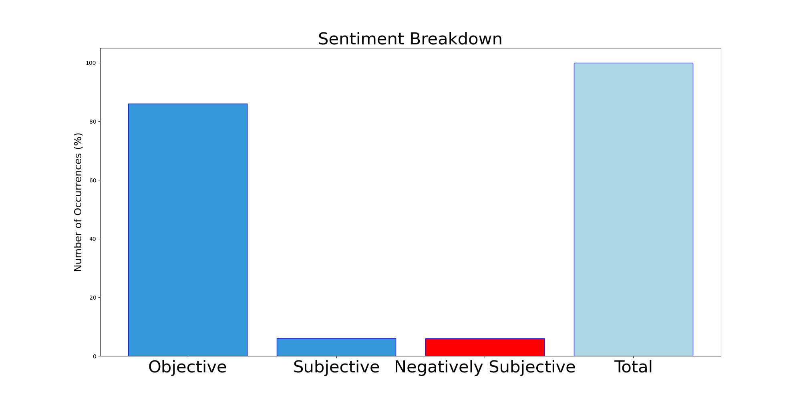

# MURCHIE85 TWITTER PROCESSING 
&#x1F34E; **TOPIC = "LaPen"**

## AUTOMATED RESEARCH SUMMARY

**Most trending image related to LaPen**
  
<b> This report is AUTOMATED and not hand crafted, it is designed for pulling metrics on a given keyword or hashtag and performs a series of reporting and analysis.</b>

**Graph 1: most commonly tweeted words by Frequency**  

**Img: TweetCloud**  

### TRENDING SHARED IMAGE

|                **Sample-Tweets**        |
| :-------------: |
| @HelenaGron @Deeyah_Khan Everywhere it is , there seems to be a pandemic of dangerous  leaders be it #lapen, #trump, #modi |
| @Justaranch It’s unbelievable they would even consider LaPen the Putin praiser. |
| @Laurieluvsmolly @RepStefanik This Lapen surported Putin to get the peace of land, cramia, she was given money from… https://t.co/B7kBFw8taf |

The most popular user is: **lapen_mocca78**

 RT @Tactical_Times: Anfield sang you'll never walk alone and Man United's traveling support sang "murderers".

## RELATED METRICS 
| Metric | Value |
| ------------- | ------------- |
| `#1 Most tweeted to`  | **timruss2** |
| `#2 Most tweeted to`  | **RepStefanik** |
| `#3 Most tweeted to`  | **Laurieluvsmolly** |
| NewProfiles (less than 10 days) | 0.38%  |
| Tweeters with < 10 followers  | 9.47%|
| Tweeters with > 1000000 followers  | 0.76%  |

## MOST POPULAR TWEET TERMS 

| Popularity Rank  | Term |
| ------------- | ------------- |
| first  | **LAPEN**  |
| second  | **FRANCE**  |
| third  | **MACRON** |
| fourth  | **AGAINST**  |
| fifth  | **WEEKEND**  |

## Twitter Bio Analysis**Graph 2: These are the words the tweeters use to describe themselves.**
**Img: Bio Cloud**  
### SENTIMENT ANALYSIS

VIEWS WERE : **SUBJECTIVE**  (6.67%) & **NEGATIVELY-SUBJECTIVE** (6.67%) **OBJECTIVE** (86.67%)

### TWEET SAMPLE 
| Random value picked from array |
| ------------- |
|RT @rhartfield01: @TristanSnell Don’t make the mistake the USA made by voting for LaPen. |

### MOST RETWEETED 

| The most retweeted user is: **lapen_mocca78**  |
| ------------- |
| RT @Tactical_Times: Anfield sang you'll never walk alone and Man United's traveling support sang "murderers". |

### CONCLUSION & EXTERNAL ANALYSIS

*This is my [Adam McMurchie`s] opinion on the data from the tweets, it serves as no objective truth.Since the tweets themselves are a mixture of fact & opinion. 
Authors analytical summary on request.
**RECOMMENDATIONS** WILL BE UPDATED IN NEXT  24 HOURS  